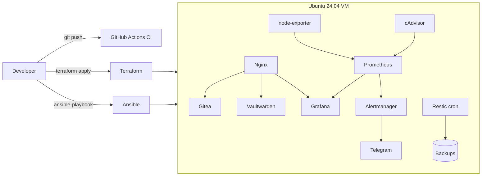

# Architecture — v14.0.0

```mermaid
flowchart LR
  Dev[Developer] -->|git push| GH[GitHub Actions CI]
  Dev -->|terraform apply| TF[Terraform] --> VM
  Dev -->|ansible-playbook| AN[Ansible] --> VM
  subgraph VM[Ubuntu 24.04 VM]
    NG[Nginx] --> GT[Gitea]
    NG --> VW[Vaultwarden]
    NG --> GF[Grafana]
    PR[Prometheus] --> GF
    NE[node-exporter] --> PR
    CA[cAdvisor] --> PR
    PR --> AM[Alertmanager] --> TG[Telegram]
    RS[Restic cron] --> BK[(Backups)]
  end
```
